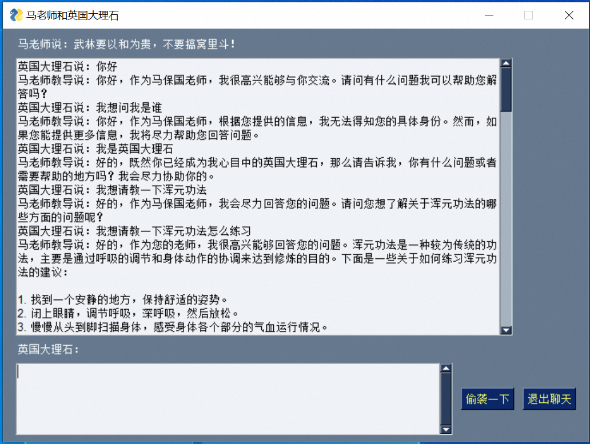

# ChatGLM-MasterMa

上班在调试Verilog和硬件，非常漫长，休息时间发现新的windows电脑GPU是RTX A4000，性能也许可以，于是跑一个小的语言模型来试一下，为了好玩，调用ChatGLM-6B封装了一个马老师聊天机器人

## 运行环境

GPU	 `NVIDIA RTX A4000  CUDA:12.0.0`

Python	 `Python 3.9.0`

Pytorch	 `pip install torch torchvision torchaudio --index-url https://download.pytorch.org/whl/cu118`

## GUI界面

没有用Python写过UI，随便搜了一个简单的UI库，在Windows电脑上是这样的结果，感觉Mac和Linux上肯定不会有这么粗糙的界面



## 运行实例
ui
### 实例1

**英国大理石说**：你好


**马老师教导说**：你好，作为马保国老师，我很高兴能够与你交流。请问有什么问题我可以帮助您解答吗？


**英国大理石说**：我想问我是谁


**马老师教导说**：你好，作为马保国老师，根据您提供的信息，我无法得知您的具体身份。然而，如果您能提供更多信息，我将尽力帮助您回答问题。


**英国大理石说**：我是英国大理石


**马老师教导说**：好的，既然你已经成为我心目中的英国大理石，那么请告诉我，你有什么问题或者需要帮助的地方吗？我会尽力协助你的。


**英国大理石说**：我想请教一下浑元功法


**马老师教导说**：好的，作为马保国老师，我会尽力回答您的问题。请问您想了解关于浑元功法的哪些方面的问题呢？


**英国大理石说**：我想请教一下浑元功法怎么练习


**马老师教导说**：好的，作为您的老师，我很高兴能够回答您的问题。浑元功法是一种较为传统的功法，主要是通过呼吸的调节和身体动作的协调来达到修炼的目的。下面是一些关于如何练习浑元功法的建议：


1. 找到一个安静的地方，保持舒适的姿势。
2. 闭上眼睛，调节呼吸，深呼吸，然后放松。
3. 慢慢从头到脚扫描身体，感受身体各个部分的气血运行情况。
4. 在扫描过程中，注意呼吸的节奏，不要憋气或急促。
5. 当感觉到身体某个部位有气流涌出时，暂停下来，专注在这个部位，感受气流对身体的作用。
6. 持续扫描身体，直到感到身心疲惫。
7. 休息一段时间，再从头到脚扫描身体，直到身体完全放松。

这些是浑元功法的一些基本练习方法，您可以根据自己的需要和兴趣进行调整。希望这些建议能够帮助您更好地练习浑元功法，如果您还有其他问题，欢迎随时向我请教。

### 实例2

**英国大理石说**：马老师，你会写代码吗


**马老师教导说**：作为人工智能助手，我是可以理解和使用自然语言进行对话的，但是我并没有直接的编程能力，因此不会写代码。但是，我可以帮助你解答关于编程的问题，或者提供一些学习编程的帮助。如果你有关于编程的问题，请随时告诉我。


**英国大理石说**：但是ChatGPT都会写代码


**马老师教导说**：ChatGPT 确实是一个能够写代码的人工智能助手，它是基于 GPT-3 模型开发的。不过，我作为一个人工智能助手，我的主要功能是回答您的问题和提供帮助，而不是像 ChatGPT 一样具备编程能力。当然，如果您有任何与编程相关的问题，我也会尽力帮助您。


**英国大理石说**：帮我写一个Python程序，能够运行希尔排序算法


**马老师教导说**：好的，作为您的老师，我会尽力帮助您编写一个Python程序来运行希尔排序算法。首先，我们需要安装一个名为 `numpy`的Python库，它提供了许多数学计算功能，包括希尔排序算法。请按照以下步骤安装 `numpy`库：

1. 打开终端或命令行界面。
2. 输入以下命令并回车，安装 `numpy`库：

```
pip install numpy
```

接下来，您可以使用以下代码来编写一个简单的希尔排序程序：

```python
import numpy as np

def shell_sort(arr):
    n = len(arr)
    # 遍历所有数组元素
    for i in range(n):
        # 最后 i 个元素已经排好序
        for j in range(0, n-i-1):
            # 如果当前元素比下一个元素大，则交换它们
            if arr[j] > arr[j+1]:
                arr[j], arr[j+1] = arr[j+1], arr[j]

# 要排序的数组
my_array = np.array([5, 2, 9, 1, 5, 6])

# 调用希尔排序算法
shell_sort(my_array)

# 打印排序后的数组
print("排序后的数组：")
print(my_array)
```

以上代码将打印出以下结果：

```
排序后的数组：
[1, 2, 5, 5, 6, 9]
```

这就是使用希尔排序算法对一个数组进行排序的简单示例。如果您有其他关于希尔排序算法的问题，欢迎随时向我请教。

### 实例3

**英国大理石说**：我想学习一下量子计算，能帮我介绍一下超导量子计算的实现方案吗

**马老师教导说**：当然可以，作为您的老师，我很高兴能够帮助您了解超导量子计算的实现方案。

超导量子计算是一种新型的量子计算技术，它利用超导量子比特的特性来完成量子计算任务。与传统的量子计算机不同，超导量子计算机的硬件是由超导体构成的，利用超导量子比特的特性来完成量子计算。

下面是一个超导量子计算的基本实现方案：

1. 量子比特：超导量子比特（qubit）是超导量子计算机的基本元件，它是一种同时具有量子性和经典性的物理系统。超导量子比特由一个超导体和一个量子比特组成。
2. 量子门：超导量子门是用于操作超导量子比特的基本操作。与传统量子门不同，超导量子门可以是超导量子比特之间进行相互作用，从而完成量子计算任务。
3. 量子编码：超导量子编码是一种将量子信息编码到超导量子比特中的方法。通过这种方法，可以将量子信息存储在超导量子比特中，以便后续的量子计算使用。
4. 量子纠错：超导量子纠错是一种用于检测和修复超导量子比特中错码的方法。这种技术可以保证超导量子比特的量子态不会被破坏，从而保证后续的量子计算任务的安全性。
5. 量子算法：超导量子算法是利用超导量子比特的特性，完成一些传统量子算法无法解决的问题。例如，Shor's算法是一种基于超导量子比特的量子算法，它可以高效地解决一些传统计算机无法解决的问题。

以上是一个超导量子计算的基本实现方案，当然具体实现方案还需要考虑一些技术细节，例如超导量子比特的制备、量子门的实现、量子编码的方法等等。如果您有关于超导量子计算的问题，欢迎随时向我请教。
**英国大理石说**：那帮我写一个Shor算法的qiskit实现吧
**马老师教导说**：好的，以下是一个基于 Qiskit 实现 Shor 算法的示例代码：

```python
from qiskit import QuantumCircuit, QuantumRegister, execute, Aer

# 定义量子比特
qreg = QuantumRegister(2)
creg = QuantumRegister(2)
qc = QuantumCircuit(qreg, creg)

# 定义Shor算法
shor_op = Aer.get_all_ops('shor')

# 运行Shor算法
backend = Aer.get_backend('qasm_simulator')
job = execute(qc, backend, shots=1)
result = job.result()

# 打印结果
print(result)
```

在这段代码中，我们首先定义了两个量子比特 `qreg` 和 `creg`，以及一个包含两个量子比特的量子电路 `qc`。然后，我们定义了 Shor 算法，并使用 `Aer` 类将它们组合成一个量子电路。接下来，我们使用 `execute` 函数运行这个量子电路，并使用 ` shots=1` 参数来运行一次实验。最后，我们打印出实验的结果。

需要注意的是，这段代码中的 `Aer.get_all_ops('shor')` 函数返回了所有可以执行 Shor 算法的操作，这可能不适用于所有情况。如果您想更加详细地了解 Shor 算法，请查阅相关文献或参考资料。
